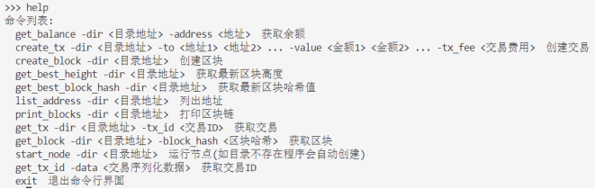
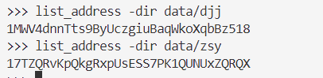
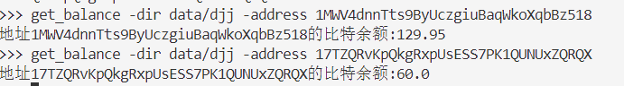
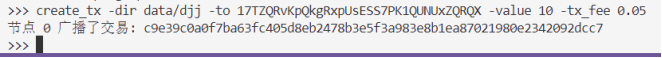
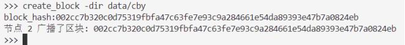
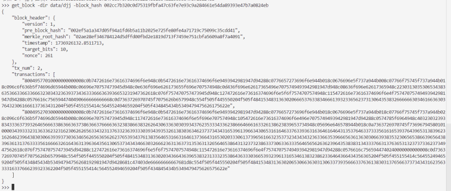
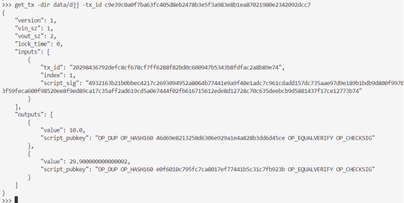
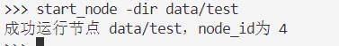
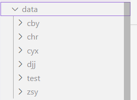
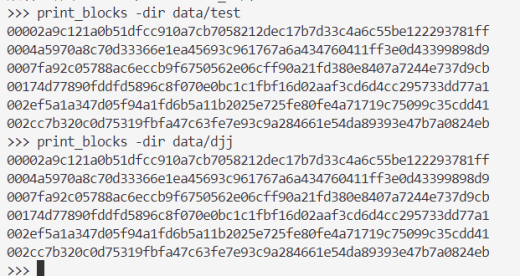

# bitcoin_network

本地比特币网络搭建

运行main.py程序，通过命令行界面对项目进行测试。

首先输入help命令查看命令列表：

通过list_address命令获取某一节点的比特币地址，如下图：

通过get_balance命令获取指定节点的比特币余额，如下图：

通过create_tx命令创建一笔交易，发起一次转账并广播，如下图：

通过create_block命令创建一个区块打包交易并广播出去，如下图：

通过get_block命令就可以根据区块block的哈希值获得区块的JSON格式，如下图：

通过get_tx命令根据指定的交易hash值查看该交易的JSON格式，如下图:

再次通过get_balance命令获取指定节点的比特币余额可以看到转账成功，如下图：

通过start_node命令程序会自动创建一个节点并通过广播version消息的方式，同步区块链，如下图：

通过print_blocks打印刚刚我们创建节点的区块链，可以发现区块链同步成功，如下图：

